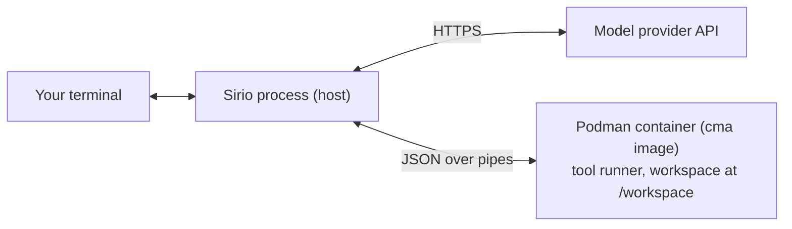

# Sirio
Sirio is a small terminal coding agent written in C. It adapts the agent layer of [ds4](https://github.com/antirez/ds4) to use model provider APIs instead of the in-process inference engine, and runs file, shell and web tools inside a short-lived Podman container instead of on the host.

## Thanks
Thanks to Salvatore Sanfilippo (antirez) for [ds4](https://github.com/antirez/ds4): Sirio's agent layer derives directly from it. See [LICENSE](LICENSE).

## Motivation
Most available coding agents are large, layered stacks that are hard to read end to end and ds4's agent layer stood out for the opposite reason: it is compact enough to read, understand and start building on.

Sirio keeps that shape while moving two boundaries. Inference goes to model provider APIs/OAuth, so one small program can drive different models without embedding an inference engine. Tool execution goes into a short-lived Podman container, so file, shell and web tools run off the host: an agent that runs arbitrary commands and edits gets an ephemeral, disposable environment instead of requiring trust or constant supervision. The goal is not a general agent framework: it is a small C program that stays easy to run, inspect and change.

Anyway Sirio is a personal project — a way to understand how a coding agent actually works (the agent loop, tool protocols, provider streaming) by building and using one.

## How it works
Compared to ds4, Sirio changes where two things happen: inference is delegated to model provider APIs, and tool execution moves from the host into a container. The agent loop itself keeps ds4's shape.

- **Podman is the tool boundary.** Every tool call — file edits, shell commands, web browsing — executes inside a short-lived container started from the repository's `cma` image. The container is created with `--rm`, runs with `--userns=keep-id`, bind-mounts the selected workspace read-write at `/workspace`, and keeps outbound network access for the web and shell tools. The host talks to a tool runner inside the container over a small JSON protocol on pipes.

A run looks like this: your prompt is sent to the model with Sirio's system prompt and tool schemas; when the model emits a tool call, Sirio forwards it to the container and appends the observation to the conversation; the loop repeats until the model answers. Near the context limit Sirio compacts the conversation automatically, summarizing durable state and keeping a recent verbatim tail (`/compact` triggers the same mechanism by hand).



## Provider and models
Sirio supports four providers:
- `deepseek` (API key): deepseek-v4-flash, deepseek-v4-pro.
- `openai` (API key or OAuth login): gpt-5.6-sol, gpt-5.6-terra, gpt-5.6-luna.
- `opencode-go` (API key): deepseek-v4-flash, deepseek-v4-pro, glm-5.3.
- `kimi` (API key): k3, k3-256k, kimi-for-coding.

Each catalog entry carries its context size, output limit and supported reasoning efforts (`none`, `low`, `medium`, `high`, `xhigh`, `max`). Models are marked `interface` when they belong to your configured interface set and can drive the main session, or `subagent` when only the `subagent` tool can select them. Inspect the catalog with:
```sh
./sirio catalog --providers
./sirio catalog --models
```

## Build
Sirio requires a C11 compiler, libcurl, POSIX threads and Make:
```sh
make sirio
make install
```

`make install` installs an already-built binary in `/usr/local/bin` and asks for superuser permissions. Set `PREFIX` to choose another directory.

Agent runs also require Podman and the repository's `cma` image:
```sh
./container/build.sh
```

The script compiles the tool runner inside Linux and tags the image as `cma`; set `CONTAINER_ENGINE` to use a build engine other than Podman. The image is a Debian bookworm-slim multistage build containing the tool runner, headless Chromium and Python 3. Sirio does not build or pull the image automatically. `--raw-prompt` does not start a container.

## Configure
Sirio keeps its state in `~/.sirio/`: `auth.json` (credentials, written atomically with owner-only permissions), `default.json` (the ordered interface model set and the last selection) and `sessions/` (saved sessions, named by SHA).

Choose the interface models, in selection order:
```sh
./sirio catalog --default opencode-go/deepseek-v4-flash,opencode-go/deepseek-v4-pro
```

The command creates the state directory and default file when needed. It is idempotent, so existing entries are not duplicated. To remove models:
```sh
./sirio catalog --remove opencode-go/deepseek-v4-pro
```

Authentication is managed separately:
```sh
./sirio auth --api-key opencode-go
./sirio auth --api-key deepseek
./sirio auth --api-key openai
./sirio auth --login openai      # interactive OAuth
./sirio auth --api-key kimi
./sirio auth --status            # credential availability, no secrets
```

## Run
Start the interactive interface, or run one prompt:
```sh
./sirio
./sirio -C /path/to/project
./sirio --non-interactive -p "Explain this repository"
./sirio --raw-prompt --non-interactive -p "Say hello"   # no tools, no container
```

Without `--model`, Sirio reuses the last interface model and reasoning when its credentials are available, then tries the configured interface order. Useful run options include `-m/--model`, `--think LEVEL`, `-n/--tokens N`, `--temp F`, `--top-p F`, `--trace FILE`, `-sys/--system TEXT` and `--edit-upto`. See `./sirio --help` and the command-specific help for the full list.

Inside the interface:
- **Commands:** `/help`, `/save`, `/compact`, `/list`, `/model`, `/switch`, `/del`, `/strip`, `/history`, `/new`, `/quit`.
- **Controls:** Ctrl+C interrupts generation; Enter queues text while the agent is busy; Ctrl+X edits the first queued prompt; ESC sends it immediately; Ctrl+D exits from an empty prompt; Alt+k / Alt+l select the previous or next interface model; Alt+, / Alt+. decrease or increase reasoning effort.

Saved sessions can be listed, resumed or deleted:
```sh
./sirio sessions --list
./sirio sessions --resume ID
./sirio sessions --delete ID
```

A saved session may keep using its model after it is removed from the interface, as long as that model is still supported.

## Tests
```sh
make test
make sanitize
```

`make test` builds Sirio and runs the standalone test suite, including the container runner contract test. `make sanitize` repeats it under AddressSanitizer and UBSan.

## Known limitations
- Session history shown by `sessions --resume`, `/switch` or `/history` is not yet rendered exactly like live output; some formatting may appear as plain text.
- `google_search` can repeatedly hit Google's automated-traffic block. For a known URL, use `visit_page` or `curl` through the `bash` tool.
